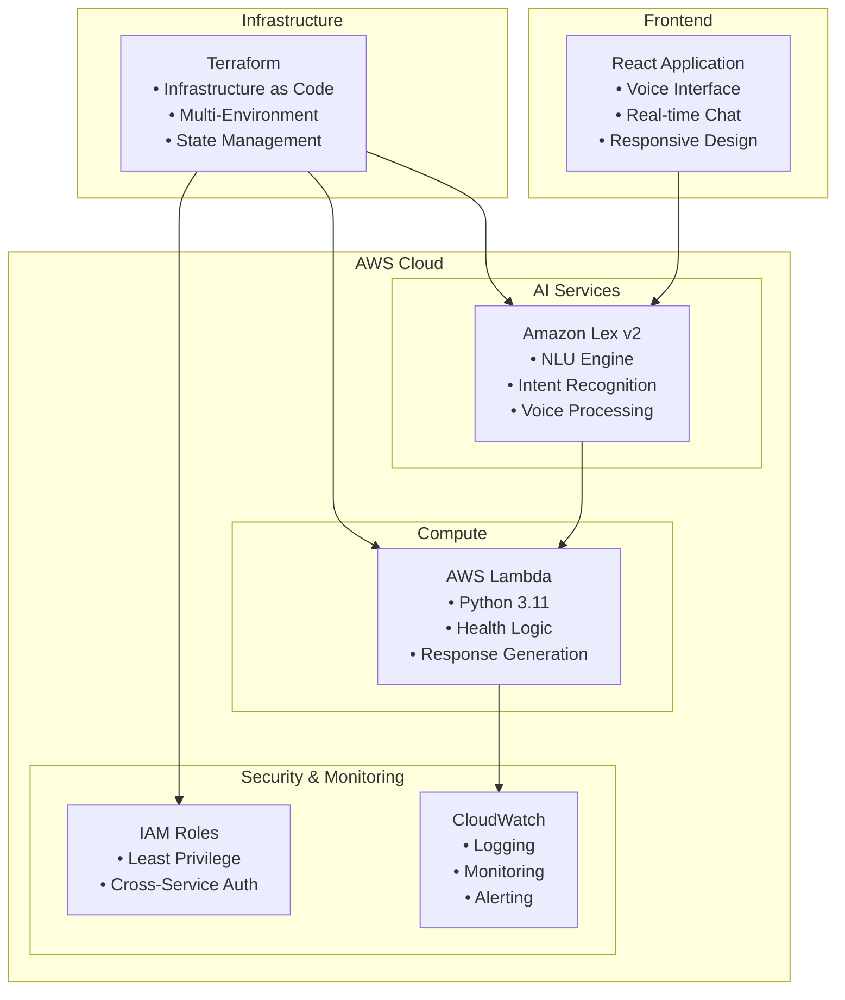

# 🏥 AWS Health Advice Chatbot

> **Production-ready serverless health advice application powered by AWS Lex v2, Lambda, and React**

[](https://aws.amazon.com/)
[](https://terraform.io/)
[](https://reactjs.org/)
[](https://python.org/)
[](https://opensource.org/licenses/MIT)

## 📋 **Overview**

The AWS Health Advice Chatbot is a comprehensive **portfolio project** that demonstrates enterprise-level cloud engineering skills through a modern, serverless architecture. Built with AWS Lex v2 for natural language understanding, AWS Lambda for serverless compute, and React for the frontend interface.

### **🎯 Key Features**

- **🤖 Intelligent Conversations** - Natural language processing with AWS Lex v2
- **🎤 Voice Interface** - Speech-to-text and text-to-speech capabilities
- **⚡ Serverless Architecture** - Cost-effective, auto-scaling infrastructure
- **🏗️ Infrastructure as Code** - Complete Terraform automation
- **🔒 Enterprise Security** - IAM least-privilege, encryption, monitoring
- **📱 Modern Frontend** - Responsive React application with real-time chat

---

## 🏗️ **Architecture**



---

## 🚀 **Quick Start**

### **Prerequisites**

```bash
# Required tools
aws --version        # AWS CLI v2+
terraform --version  # Terraform v1.0+
node --version       # Node.js v16+
python3 --version    # Python 3.11+
```

### **Deployment**

1. **Clone the repository**
   ```bash
   git clone <repository-url>
   cd aws-health-advice-chatbot
   ```

2. **Configure AWS credentials**
   ```bash
   aws configure
   # Enter your AWS Access Key ID, Secret, Region, and Output format
   ```

3. **Deploy infrastructure**
   ```bash
   cd infra
   cp terraform.tfvars.example terraform.tfvars
   # Edit terraform.tfvars with your preferences
   
   terraform init
   terraform plan
   terraform apply
   ```

4. **Configure frontend**
   ```bash
   cd ../frontend
   cp .env.example .env
   # Update .env with Terraform output values
   
   npm install
   npm start
   ```

5. **Access the application**
   - Open http://localhost:3000
   - Start chatting with the health advice assistant!

---

## 💬 **Health Topics**

The chatbot provides evidence-based guidance on:

| Topic | Example Questions | Sample Advice |
|-------|------------------|---------------|
| **🥗 Nutrition** | "Give me healthy diet tips" | Whole foods, portion control, hydration |
| **🏃‍♀️ Exercise** | "What exercises should I do?" | 150min/week cardio, strength training |
| **🧘‍♀️ Mental Wellness** | "Help me manage stress" | Mindfulness, social connections, gratitude |
| **😴 Sleep** | "How can I sleep better?" | Consistent schedule, sleep hygiene |
| **💧 Hydration** | "How much water should I drink?" | 8 glasses daily, activity adjustments |

### **Sample Conversation**

```
👤 User: "I need help with healthy eating habits"

🤖 Bot: "Here's some excellent nutrition guidance:

🥗 Focus on whole foods - fruits, vegetables, lean proteins, and whole grains provide essential nutrients.

🍽️ Practice portion control using the plate method: half vegetables, quarter protein, quarter whole grains.

💧 Stay hydrated with 8-10 glasses of water daily to support all bodily functions.

⚠️ Important: This is general health information for educational purposes only. Always consult with qualified healthcare providers for personalized medical guidance."
```

---

## 🛠️ **Technology Stack**

### **Backend & Infrastructure**
- **Amazon Lex v2** - Natural language understanding and voice processing
- **AWS Lambda** - Serverless compute with Python 3.11 runtime
- **Terraform** - Infrastructure as Code with state management
- **CloudWatch** - Comprehensive logging and monitoring
- **IAM** - Fine-grained access control and security

### **Frontend**
- **React 18** - Modern functional components with hooks
- **Styled Components** - CSS-in-JS with dynamic theming
- **AWS SDK v3** - Modular cloud service integration
- **Web Speech API** - Browser-native voice capabilities

---

## 📁 **Project Structure**

```
aws-health-advice-chatbot/
├── 📂 infra/                     # Terraform Infrastructure
│   ├── main.tf                   # Core AWS resources
│   ├── variables.tf               # Input variables
│   ├── outputs.tf                 # Infrastructure outputs
│   └── terraform.tfvars.example   # Configuration template
├── 📂 lambda/                     # Serverless Functions
│   └── healthAdviceHandler.py     # Main Lambda function
├── 📂 frontend/                   # React Application
│   ├── src/
│   │   ├── components/            # UI components
│   │   ├── services/              # AWS service integrations
│   │   ├── config.js              # App configuration
│   │   └── App.js                 # Main application
│   ├── public/                    # Static assets
│   └── package.json               # Dependencies
└── 📄 README.md                   # This documentation
```

---

## ⚙️ **Configuration**

### **Environment Variables**

```bash
# AWS Configuration
REACT_APP_AWS_REGION=us-east-1
REACT_APP_LEX_BOT_ID=your_bot_id_here
REACT_APP_LEX_BOT_ALIAS_ID=TSTALIASID
REACT_APP_LEX_LOCALE_ID=en_US

# Application Settings
REACT_APP_ENV=production
REACT_APP_VOICE_ENABLED=true
```

### **Terraform Variables**

```hcl
# Infrastructure Configuration
aws_region    = "us-east-1"
environment   = "dev"
project_name  = "health-advice-chatbot"
bot_name      = "HealthAdviceBot"
locale_id     = "en_US"
log_level     = "INFO"
```

---

## 🧪 **Testing**

### **Local Testing**

```bash
# Test Lambda function locally
cd lambda
python3 healthAdviceHandler.py

# Test frontend
cd frontend
npm test

# Infrastructure validation
cd infra
terraform validate
terraform plan
```

### **Integration Testing**

```bash
# Test end-to-end conversation flow
curl -X POST https://your-api-endpoint/chat \
  -H "Content-Type: application/json" \
  -d '{"message": "Give me nutrition advice"}'
```

---

## 💰 **Cost Optimization**

### **Estimated Monthly Costs**

| Usage Level | Lambda | Lex | CloudWatch | Total |
|-------------|--------|-----|------------|-------|
| **Development** | $1 | $2 | $1 | **~$4** |
| **Light Production** | $3 | $8 | $2 | **~$13** |
| **Medium Production** | $8 | $20 | $5 | **~$33** |

### **Cost Optimization Features**
- **Right-sized Lambda** - 256MB memory allocation
- **Efficient Lex Design** - Optimized intent structure
- **Log Retention** - 14-day CloudWatch retention
- **Auto-scaling** - Pay only for actual usage

---

## 🔒 **Security**

### **Security Implementation**
- **IAM Least Privilege** - Function-specific roles with minimal permissions
- **Data Protection** - No PII storage, stateless conversations
- **Encryption** - TLS 1.2+ for all data in transit
- **Input Validation** - Sanitization and validation in Lambda
- **Monitoring** - CloudWatch logging for security events

### **Compliance Considerations**
- **HIPAA Ready** - Architecture supports healthcare compliance
- **GDPR Compliant** - No personal data retention
- **Healthcare Disclaimers** - All responses include medical disclaimers

---

## 📈 **Monitoring & Observability**

### **CloudWatch Metrics**
- Lambda execution duration and errors
- Lex conversation success rates
- User interaction patterns
- Cost and usage analytics

### **Alerting**
- Error rate thresholds
- Unusual traffic patterns
- Cost budget notifications

---

## 🎯 **Professional Portfolio Value**

### **Skills Demonstrated**
- ✅ **AWS Cloud Architecture** - Lex, Lambda, IAM, CloudWatch
- ✅ **Infrastructure as Code** - Advanced Terraform patterns
- ✅ **Serverless Development** - Event-driven Python functions
- ✅ **Modern Frontend** - React 18 with AWS SDK integration
- ✅ **DevOps Practices** - CI/CD ready, monitoring, security
- ✅ **AI/ML Integration** - Natural language processing
- ✅ **Production Readiness** - Scalability, security, cost optimization

### **Interview Talking Points**
1. **Architecture Decisions** - Why serverless? Lex v2 benefits? Cost considerations?
2. **Scalability Planning** - How would you handle 10x traffic? Multi-region deployment?
3. **Security Implementation** - IAM design, data protection, compliance requirements
4. **Monitoring Strategy** - Observability, alerting, incident response
5. **Cost Optimization** - Resource right-sizing, usage patterns, budget controls

---

## 🔧 **Development**

### **Local Development**

```bash
# Start frontend development server
cd frontend
npm start

# Test Lambda function
cd lambda
python3 -m pytest tests/

# Validate infrastructure
cd infra
terraform fmt
terraform validate
```

### **Adding New Health Topics**

1. **Update Terraform** - Add new intent in `main.tf`
2. **Extend Lambda** - Add advice content in `healthAdviceHandler.py`
3. **Update Frontend** - Add topic configuration in `config.js`

---

## 📚 **Documentation**

- **[Architecture Guide](docs/)** - Detailed system design and patterns
- **[Deployment Guide](docs/)** - Step-by-step deployment instructions
- **[API Reference](docs/)** - Lambda function and integration details
- **[Security Guide](docs/)** - Security implementation and best practices

---

## 🤝 **Contributing**

This is a portfolio project demonstrating cloud engineering skills. For feedback or collaboration:

1. Fork the repository
2. Create a feature branch
3. Implement improvements
4. Submit a pull request

---

## 📄 **License**

This project is licensed under the MIT License - see the [LICENSE](LICENSE) file for details.

---

## 🏆 **Portfolio Contact**

**Ready to discuss this project or similar cloud solutions?**

- 💼 **LinkedIn**: [Your LinkedIn Profile]
- 📧 **Email**: [Your Professional Email]
- 🐙 **GitHub**: [Your GitHub Profile]
- 🌐 **Portfolio**: [Your Portfolio Website]

---

<div align="center">

**⭐ Star this repository if it demonstrates the cloud engineering skills you're looking for!**

*Built with ❤️ to showcase modern AWS development practices*

</div>