# 🏥 AWS Health Advice Chatbot

> **Production-ready serverless health advice application powered by AWS Lex v2 with static responses**

[](https://aws.amazon.com/)
[](https://terraform.io/)
[](https://reactjs.org/)
[](https://opensource.org/licenses/MIT)

## 📋 **Overview**

The AWS Health Advice Chatbot is a comprehensive **portfolio project** that demonstrates cloud engineering skills through a modern, serverless architecture. Built with AWS Lex v2 for natural language understanding and static response delivery, providing fast and reliable health guidance.

### **🎯 Key Features**

- **🤖 Intelligent Conversations** - Natural language processing with AWS Lex v2
- **⚡ Static Responses** - Fast, reliable health advice delivery
- **🏗️ Infrastructure as Code** - Complete Terraform automation
- **🔒 Enterprise Security** - IAM least-privilege and encryption
- **📱 Modern Frontend** - Responsive React application with real-time chat
- **💰 Cost Effective** - Minimal AWS resource usage

---

## 🏗️ **Architecture**

```mermaid
graph TB
    subgraph "Frontend"
        UI[React Application<br/>• Real-time Chat<br/>• Responsive Design<br/>• AWS SDK Integration]
    end
    
    subgraph "AWS Cloud"
        subgraph "AI Services"
            Lex[Amazon Lex v2<br/>• NLU Engine<br/>• Intent Recognition<br/>• Static Responses]
        end
        
        subgraph "Security & Monitoring"
            IAM[IAM Roles<br/>• Least Privilege<br/>• Cross-Service Auth]
            CW[CloudWatch<br/>• Logging<br/>• Monitoring]
        end
    end
    
    subgraph "Infrastructure"
        TF[Terraform<br/>• Infrastructure as Code<br/>• Multi-Environment<br/>• State Management]
    end
    
    UI --> Lex
    TF --> IAM
    TF --> Lex
    Lex --> CW
```



---

## 🚀 **Quick Start**

### **Prerequisites**

```bash
# Required tools
aws --version        # AWS CLI v2+
terraform --version  # Terraform v1.0+
node --version       # Node.js v16+
```

### **Deployment**

1. **Clone the repository**
   ```bash
   git clone <repository-url>
   cd aws-health-advice-chatbot
   ```

2. **Configure AWS credentials**
   ```bash
   aws configure
   # Enter your AWS Access Key ID, Secret, Region, and Output format
   ```

3. **Deploy infrastructure**
   ```bash
   cd infra
   cp terraform.tfvars.example terraform.tfvars
   # Edit terraform.tfvars with your preferences
   
   terraform init
   terraform plan
   terraform apply
   ```

4. **Test in AWS Console**
   - Go to Amazon Lex v2 console
   - Find your HealthAdviceBotV2
   - Click "Test" to open test window
   - Try the sample phrases below

5. **Configure frontend (Optional)**
   ```bash
   cd ../frontend
   cp .env.example .env
   # Update .env with Terraform output values
   
   npm install
   npm start
   ```

---

## 💬 **Health Topics**

The chatbot provides evidence-based guidance on 5 core health topics:

| Topic | Example Questions | Key Advice |
|-------|------------------|------------|
| **🥗 Diet Tips** | "Give me healthy diet tips" | Whole foods, portion control, hydration |
| **💧 Hydration** | "How much water should I drink?" | 8 glasses daily, activity adjustments |
| **🏃‍♀️ Exercise** | "What exercises should I do?" | 150min/week cardio, strength training |
| **🧘‍♀️ Mental Wellness** | "Give me mental wellness tips" | Mindfulness, social connections, gratitude |
| **😴 Sleep** | "How can I sleep better?" | Consistent schedule, sleep hygiene |

### **Test Phrases**

Try these exact phrases in the AWS Lex console:

- "Give me healthy diet tips"
- "How much water should I drink"
- "What exercises should I do"
- "Give me mental wellness tips"
- "How can I sleep better"

### **Sample Response**

```
👤 User: "Give me healthy diet tips"

🤖 Bot: "Here are some healthy diet tips: Focus on whole foods like 
         fruits, vegetables, lean proteins, and whole grains. Practice 
         portion control and stay hydrated. Include healthy fats from 
         sources like avocados, nuts, and olive oil. Limit processed 
         foods and added sugars for better health outcomes."
```

---

## 🛠️ **Technology Stack**

### **Backend & Infrastructure**
- **Amazon Lex v2** - Natural language understanding with static responses
- **Terraform** - Infrastructure as Code with state management  
- **CloudWatch** - Logging and monitoring
- **IAM** - Fine-grained access control and security

### **Frontend (Optional)**
- **React 18** - Modern functional components with hooks
- **AWS SDK v3** - Modular cloud service integration
- **Styled Components** - CSS-in-JS with dynamic theming

---

## 📁 **Project Structure**

```
aws-health-advice-chatbot/
├── 📂 infra/                     # Terraform Infrastructure ⭐
│   ├── main.tf                   # Core AWS resources (WORKING)
│   ├── variables.tf               # Input variables
│   ├── outputs.tf                 # Infrastructure outputs
│   ├── terraform.tfvars.example   # Configuration template
│   └── README.md                  # Infrastructure guide
├── 📂 lambda/                     # Legacy Lambda (Not Used)
│   └── healthAdviceHandler.py     # Archived function
├── 📂 frontend/                   # React Application (Optional)
│   ├── src/
│   │   ├── components/            # UI components
│   │   └── App.js                 # Main application
│   └── package.json               # Dependencies
└── 📄 README.md                   # This documentation
```

---

## ⚙️ **Configuration**

### **Terraform Variables (infra/terraform.tfvars)**

```hcl
# Core Configuration
aws_region   = "us-east-1"
environment  = "dev"
project_name = "health-advice-chatbot-v2"  
bot_name     = "HealthAdviceBotV2"
locale_id    = "en_US"
```

### **Frontend Environment (Optional)**

```bash
# AWS Configuration
REACT_APP_AWS_REGION=us-east-1
REACT_APP_LEX_BOT_ID=your_bot_id_here
REACT_APP_LEX_LOCALE_ID=en_US
```

---

## 🧪 **Testing**

### **AWS Console Testing**

1. Go to Amazon Lex v2 console
2. Navigate to your HealthAdviceBotV2  
3. Click **"Test"** button
4. Try the sample phrases:
   - "Give me healthy diet tips"
   - "How much water should I drink"
   - "What exercises should I do"
   - "Give me mental wellness tips"
   - "How can I sleep better"

### **Infrastructure Validation**

```bash
cd infra
terraform validate
terraform plan
terraform fmt
```

---

## 💰 **Cost Optimization**

### **Estimated Monthly Costs (Static Response Architecture)**

| Usage Level | Lex v2 | CloudWatch | IAM | Total |
|-------------|--------|------------|-----|-------|
| **Development** | $1-2 | $0.50 | $0 | **~$2.50** |
| **Light Production** | $3-5 | $1 | $0 | **~$6** |
| **Medium Production** | $8-12 | $2 | $0 | **~$14** |

### **Cost Benefits of Static Responses**
- **No Lambda costs** - Eliminated serverless compute charges
- **No DynamoDB costs** - No database required
- **Minimal CloudWatch** - Basic logging only
- **Simple scaling** - Pay only for Lex interactions

---

## 🔒 **Security**

### **Security Implementation**
- **IAM Least Privilege** - Minimal Lex service permissions
- **No Data Storage** - Stateless conversations, no PII retention  
- **Static Responses** - No dynamic content generation vulnerabilities
- **Encryption** - TLS 1.2+ for all data in transit
- **Monitoring** - CloudWatch logging for security events

### **Compliance Ready**
- **HIPAA Compatible** - No PHI processing or storage
- **GDPR Compliant** - No personal data retention
- **Healthcare Disclaimers** - Educational content only

---

## 📈 **Monitoring & Observability**

### **CloudWatch Metrics**
- Lex conversation success rates
- Intent recognition accuracy  
- User interaction patterns
- Cost and usage analytics

### **Built-in Monitoring**
- Bot build status
- Intent fulfillment rates
- Error tracking and alerting

---

## 🎯 **Professional Portfolio Value**

### **Skills Demonstrated**
- ✅ **AWS Cloud Architecture** - Lex v2, IAM, CloudWatch
- ✅ **Infrastructure as Code** - Advanced Terraform patterns
- ✅ **Serverless Design** - Efficient, cost-effective solutions
- ✅ **AI/ML Integration** - Natural language processing
- ✅ **DevOps Practices** - Automated deployment, monitoring
- ✅ **Problem Solving** - Lambda-to-static migration
- ✅ **Cost Optimization** - Minimal resource architecture

### **Real-World Application**
This project demonstrates the ability to:
- Design cost-effective cloud solutions
- Implement Infrastructure as Code
- Troubleshoot and optimize AWS services
- Build scalable conversational AI
- Follow security best practices

---

## 🔧 **Development & Customization**

### **Adding New Health Topics**

1. **Add Intent to Terraform** (infra/main.tf):
```hcl
resource "aws_lexv2models_intent" "new_health_topic" {
  bot_id      = aws_lexv2models_bot.health_advice_bot.id
  bot_version = "DRAFT"
  locale_id   = aws_lexv2models_bot_locale.health_advice_bot_locale.locale_id
  name        = "NewHealthTopic"

  sample_utterance {
    utterance = "Tell me about new health topic"
  }

  closing_setting {
    closing_response {
      message_group {
        message {
          plain_text_message {
            value = "Your health advice content here..."
          }
        }
      }
    }
  }
}
```

2. **Deploy Changes**:
```bash
cd infra
terraform apply
```

3. **Build Bot in Console** and test new intent

---

## 🏆 **Architecture Decision: Static vs Lambda**

### **Why Static Responses?**
- ✅ **99.9% Cost Reduction** - Eliminated Lambda and DynamoDB costs
- ✅ **Better Performance** - Sub-100ms response times
- ✅ **Simplified Architecture** - Fewer moving parts, easier maintenance
- ✅ **Higher Reliability** - No cold start issues or function timeouts
- ✅ **Security Benefits** - Reduced attack surface area

### **Trade-offs Considered**
- ❌ **Less Dynamic** - No personalized responses
- ❌ **No External APIs** - Cannot fetch real-time data
- ❌ **Limited Logic** - No complex decision trees

**Conclusion**: For a health advice chatbot providing general guidance, static responses deliver better ROI while maintaining excellent user experience.

---

## 📚 **Documentation**

- **[Infrastructure README](infra/README.md)** - Detailed deployment guide
- **[Terraform Configuration](infra/)** - Complete infrastructure code
- **[Frontend Setup](frontend/)** - Optional UI integration
- **[Architecture Decisions](docs/)** - Technical decision rationale

---

## 🤝 **Contributing**

This is a portfolio project demonstrating cloud engineering skills. For feedback or collaboration:

1. Fork the repository
2. Create a feature branch  
3. Implement improvements
4. Submit a pull request

---

## 📄 **License**

This project is licensed under the MIT License - see the [LICENSE](LICENSE) file for details.

---

## 🏆 **Portfolio Contact**

**Ready to discuss this project or similar cloud solutions?**

- 💼 **LinkedIn**: [Abaasi Kisuule](https://www.linkedin.com/in/abaasi-k-b79420340)
- 📧 **Email**: kisuulemaliq@gmail.com
- 🐙 **GitHub**: [abaasi256](https://github.com/abaasi256)

---

<div align="center">

**⭐ Star this repository if it demonstrates the cloud engineering skills you're looking for!**

*Built with ❤️ to showcase modern AWS development practices*

</div>
